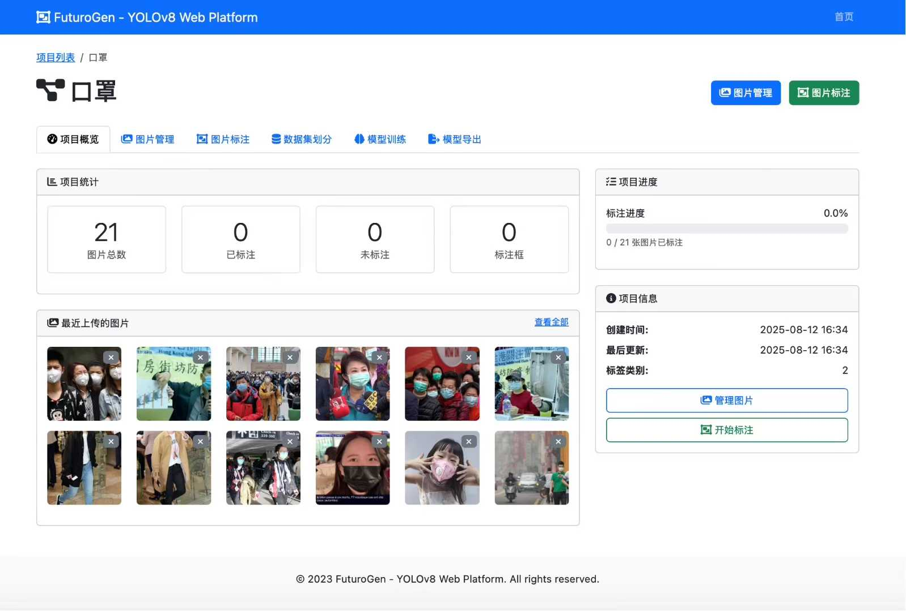
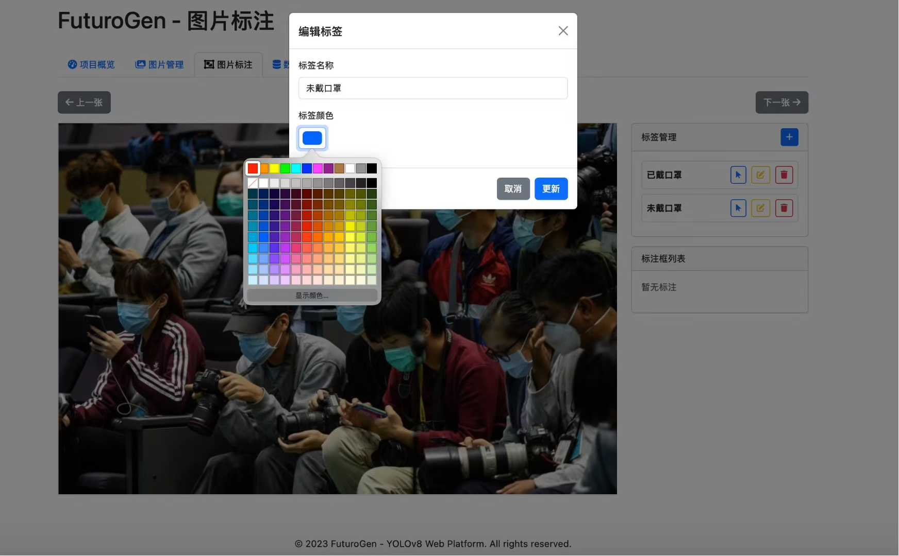
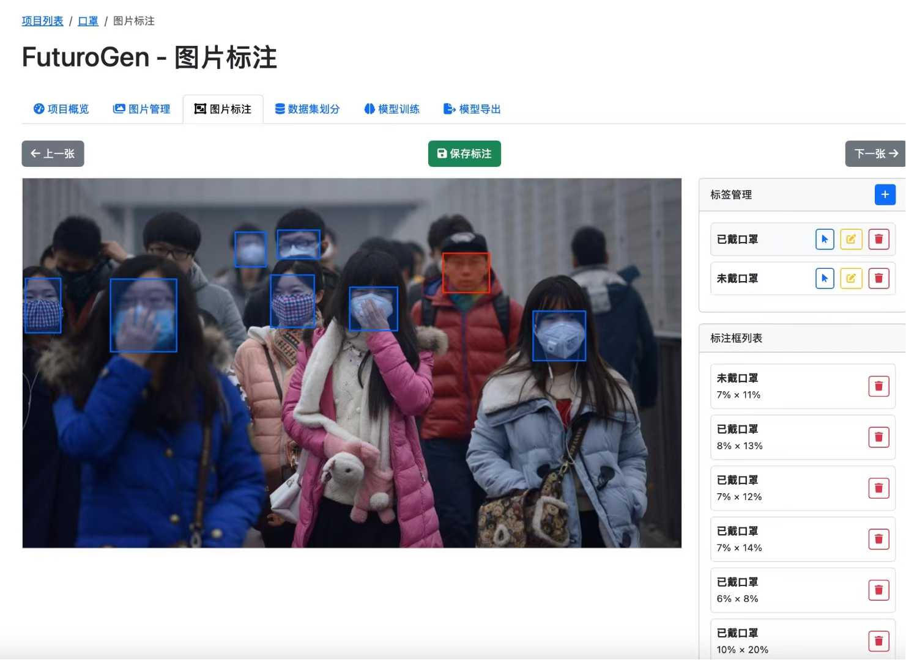
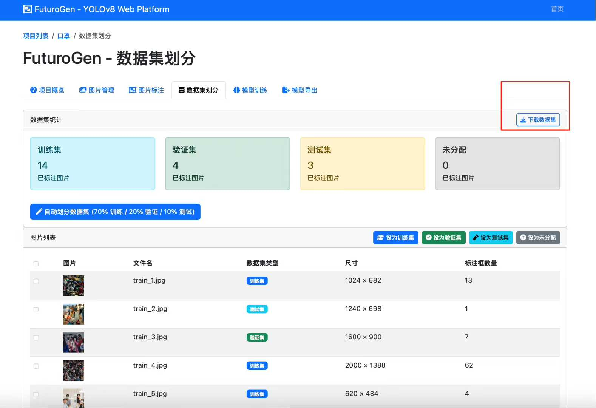
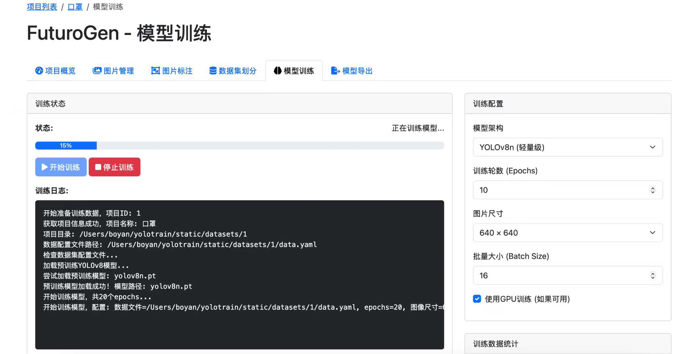
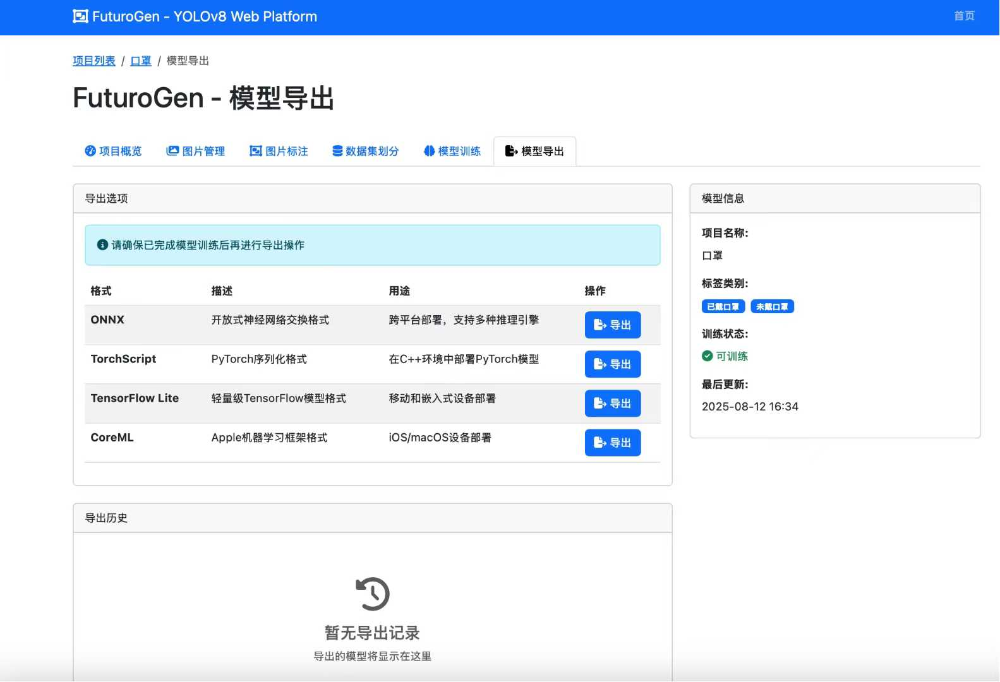

# FuturoGen - AI模型训练平台

一个基于Python Flask的Web应用，用于YOLOv8、11目标检测模型的图片标注、数据集管理、模型训练和模型导出，由Boyan开发。旨在为AI开发者和研究人员提供一个完整的、易用的目标检测模型训练解决方案。
## 创新特性
1. 多层次AI辅助标注 ：大模型+PT模型的双重AI辅助体系
2. 数据增强闭环 ："小数据→简单模型→辅助标注→大数据→精确模型"的完整循环
3. 实时检测集成 ：将训练和部署统一在一个平台
4. 项目级隔离 ：多项目并行开发，资源完全隔离
5. 全流程自动化 ：从数据标注到模型部署的完整自动化
6. 跨平台兼容 ：支持Windows、macOS、Linux多平台部署
## PT模型辅助检测的核心价值 （待发布）
### 1. 降低数据门槛
- 快速启动 ：仅需50张标注图片即可训练初始模型
- 渐进改进 ：通过模型辅助逐步扩充高质量数据集
- 成本控制 ：减少人工标注工作量，提升标注效率

## 解决的核心问题
### 1. 数据标注效率低下
- 传统问题 ：手动标注大量图片耗时费力，标注质量不一致
- 解决方案 ：集成大模型辅助标注功能，支持自动目标检测和智能标注生成
### 2. 模型训练门槛高
- 传统问题 ：需要复杂的环境配置和命令行操作
- 解决方案 ：提供Web界面化的训练流程，实时显示训练进度和日志
### 3. 数据集管理复杂
- 传统问题 ：手动组织数据集目录结构，容易出错
- 解决方案 ：自动化数据集划分和目录结构生成
### 4. 实时检测部署困难
- 传统问题 ：RTSP视频流检测需要复杂的配置
- 解决方案 ：内置RTSP实时检测功能，支持多路视频流
### 5. 数据增强循环困难
- 传统问题 ：缺乏有效的数据增强和迭代标注机制
- 解决方案 ：PT模型辅助检测，实现"小数据训练→模型辅助→数据增强→高精度模型"的良性循环

## 更新
9.12更新
 - 更新多模态大模型辅助标注功能。
 - 更新RTSP视频流推理。
 - 更新ultralytics库到最新版本。

## 功能特性

1. **项目管理**：创建、列出、删除项目
2. **图片管理**：
   - 上传单张或多张图片
   - 通过ZIP文件批量上传图片
   - 拖拽上传图片
3. **图片标注**：
   - 基于Web的边界框标注功能
   - 图片间导航（上一张/下一张）
   - 项目内标签（类别）管理：添加、编辑、删除
   - 标注数据实时保存到数据库，并自动生成YOLOv8 `.txt` 格式的标注文件
   - **🆕 大模型辅助标注**：集成AI大模型进行智能目标检测和自动标注，大幅提升标注效率
4. **数据集划分**：批量将图片标记为训练集、验证集、测试集或未分配
5. **模型训练**：
   - 实际调用 `ultralytics` 库进行模型训练
   - 训练任务在后台线程中运行，前端实时显示训练日志和进度
   - 自动准备训练所需的数据集目录结构和 `data.yaml` 文件
6. **模型导出**：将训练好的模型导出为ONNX、TorchScript等多种格式
7. **🆕 RTSP实时检测**：
   - 支持RTSP视频流实时目标检测
   - 实时显示检测结果和边界框
   - 支持多路视频流同时检测
   - 可配置检测参数和阈值

## 技术栈

- **后端**：Python 3.9+, Flask, Flask-SQLAlchemy, threading, OpenCV (cv2), Pillow (PIL.Image), ultralytics, python-dotenv, PyYAML
- **前端**：HTML5, CSS3, JavaScript, Bootstrap 5, Jinja2, Fabric.js
- **数据库**：SQLite
- **部署**：直接运行 `python app.py`

## 项目结构

```
yolov8_web_platform/
├── app.py                 # Flask应用入口
├── requirements.txt       # 项目依赖
├── .env                   # 环境变量配置
├── models.py             # 数据库模型
├── routes.py             # 路由处理
├── README.md             # 项目说明文档
├── static/               # 静态文件目录
│   ├── uploads/          # 上传图片存储目录
│   ├── datasets/         # 数据集目录
│   └── models/           # 模型存储目录
└── templates/            # HTML模板目录
    ├── base.html         # 基础模板
    ├── index.html        # 首页
    ├── project_detail.html # 项目详情页
    ├── images.html       # 图片管理页
    ├── annotate.html     # 图片标注页
    ├── dataset.html      # 数据集划分页
    ├── train.html        # 模型训练页
    └── export.html       # 模型导出页
```

## 安装与运行

1. 克隆或下载项目代码

2. 安装依赖：
   ```bash
   pip install -r requirements.txt
   ```

3. 运行应用：
   ```bash
   python app.py
   ```

4. 在浏览器中访问 `http://localhost:5500`

##运行截图




## 使用说明

1. **创建项目**：在首页点击"创建项目"按钮，输入项目名称和描述

2. **上传图片**：
   - 进入项目详情页，点击"图片管理"
   - 可以上传单张/多张图片、ZIP压缩包或通过拖拽上传

3. **图片标注**：
   - 在项目详情页点击"图片标注"
   - 先创建标签（类别），然后选择标签在图片上绘制边界框
   - 使用"上一张"/"下一张"导航到不同图片
   - 点击"保存标注"保存当前图片的标注结果
   - **🆕 大模型辅助标注**：点击"手动大模型识别标注"按钮，大模型将自动识别图片中的目标并生成标注框

4. **数据集划分**：
   - 在项目详情页点击"数据集划分"
   - 选择图片并设置为训练集、验证集、测试集或未分配

5. **模型训练**：
   - 在项目详情页点击"模型训练"
   - 点击"开始训练"按钮启动训练过程
   - 可实时查看训练进度和日志

6. **模型导出**：
   - 训练完成后，在项目详情页点击"模型导出"
   - 选择需要的导出格式（ONNX、TorchScript等）
   - 点击"导出"按钮完成模型导出

7. **🆕 RTSP实时检测**：
   - 在首页点击"RTSP实时检测"进入实时检测页面
   - 输入RTSP视频流地址
   - 选择检测模型和项目
   - 点击"开始检测"启动实时目标检测
   - 可实时查看检测结果和调整检测参数

## 注意事项

- 应用默认运行在5500端口
- 所有数据存储在本地SQLite数据库中
- 上传的图片和训练的模型都保存在本地目录中
- 首次运行时会自动创建所需的目录和数据库

## 交流群，扫码加好友进群交流，
- Boyan为本项目作者，🍉是GVP项目yolo-onnx-java作者。

  

## 许可证

本项目由Boyan开发，仅供学习和研究使用。
